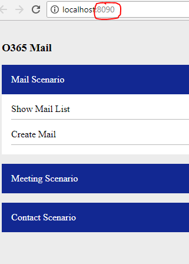
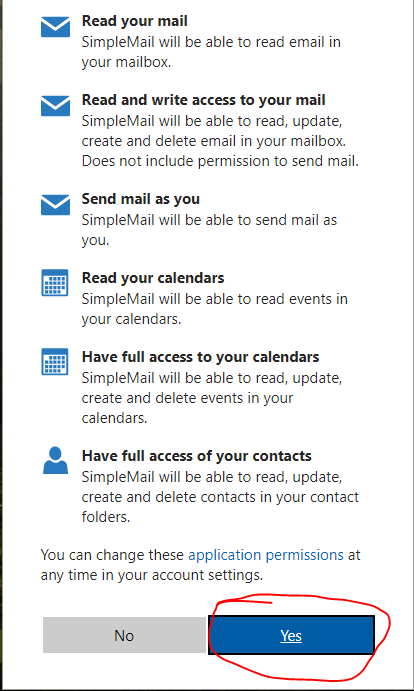

# Warm Up - Setup
In this module you will set up the solution and run the first Graph API

## Download the workshop code base
[Mail Workshop code base](https://github.com/InteropEvents/mail-app-microsoft-graph/tree/master/workshop-code-base)

## Build the solution
Build the solution in visual studio

## Run the web site, login and see your mail list

### Note: If the web server port number is not 8090, please refer to [FAQ](https://github.com/InteropEvents/mail-app-microsoft-graph/blob/master/exercises/FAQ.md) to update the port number

### Note 2: If you cannot use 8090 port in your dev machine, please refer to the [exercise 5](https://github.com/InteropEvents/mail-app-microsoft-graph/blob/master/exercises/5.%20Advanced%20-%20Make%20this%20workshop%20as%20your%20own%20App.md) to register your own app.

### login
  

### Accept the permission agreement
  

### See the mail list

