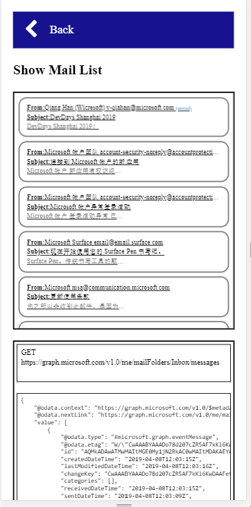

# Warm Up - Setup
In this module you will set up the solution and run the first Graph API

## Download the workshop code base
[Mail Workshop code base](https://github.com/InteropEvents/mail-app-microsoft-graph/tree/master/workshop-code-base)

## Build the solution
Build the solution in visual studio

## Run the web site, login and see your mail list

