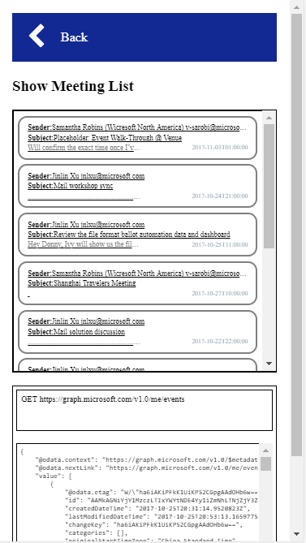

# Get your meeting list
In this module you will get your meetings

## Find the Graph API to get meetings
[List events document](https://developer.microsoft.com/en-us/graph/docs/api-reference/v1.0/api/user_list_events)

## Implement get meeting functions
"graph-meeting.js" -> Line:9
 
## Find your meetings

