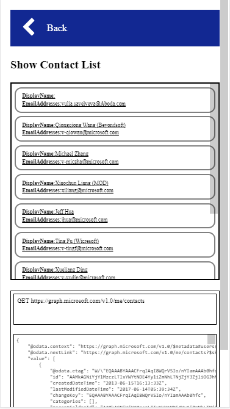

# Get your contact list
In this module you will get your contacts list.

## Find the Graph API to list contacts
See [List contacts](https://developer.microsoft.com/en-us/graph/docs/api-reference/v1.0/api/user_list_contacts) for documentation for the API.

## Implement list contacts function
Open `scripts/graph-contact.js` and find the following code.
```javascript
$.graph.prototype.ListContacts = function () {
    //https://developer.microsoft.com/en-us/graph/docs/api-reference/v1.0/api/user_list_contacts
    // Call the list contacts graph API here

};
```
Implement the list contacts function starting at line 9 in `graph-contact.js`.
 
## Get your contact list
View your list of contacts.



