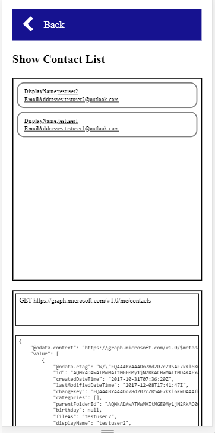

# Get your contact list
In this module you will get your contact list

## Find the Graph API to list contacts
[List contacts document](https://developer.microsoft.com/en-us/graph/docs/api-reference/v1.0/api/user_list_contacts)

## Implement list contacts function
"graph-contact.js" -> Line:9
 
## Get your contact list

