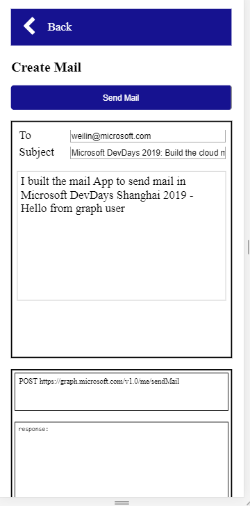

# Send A Mail to Jinlin
In this module you will send a mail to Jinlin

## Find the Graph API to send mail
[Send mail document](https://developer.microsoft.com/en-us/graph/docs/api-reference/v1.0/api/user_sendmail)

## Implement send mail functions
"graph-mail.js" -> Line:15
 
## Send a mail to Jinlin

