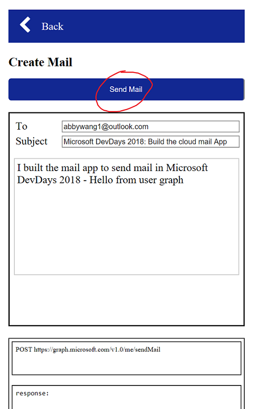

# Send A Mail
In this module you will send a mail.

## Find the Graph API to send mail
See [Send mail](https://developer.microsoft.com/en-us/graph/docs/api-reference/v1.0/api/user_sendmail) for documentation for the API.

## Implement send mail functions
Open `scripts/graph-mail.js` and find the following code.
```javascript
$.graph.prototype.SendMail = function (data) {
        //https://developer.microsoft.com/en-us/graph/docs/api-reference/v1.0/api/user_sendmail
        //Call the send mail graph API here
        
    },
    $.graph.prototype.Listmessages = function () {
        //https://developer.microsoft.com/en-us/graph/docs/api-reference/v1.0/api/user_list_messages
        return $.get.call(this, "/me/mailFolders/Inbox/messages");
    };
```
Implement the send mail functions starting at line 15 in `graph-mail.js`.
 -> Line:15

**Note:** If you are not sure about how to make a post call, please refer to the [FAQ](https://github.com/InteropEvents/mail-app-microsoft-graph/blob/master/exercises/FAQ.md)
 
## Send a mail
Use the API to send an email.
