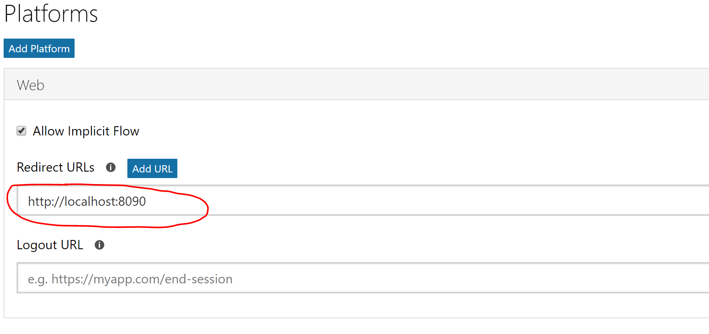
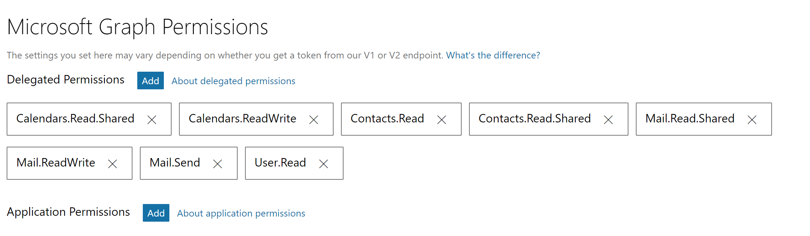
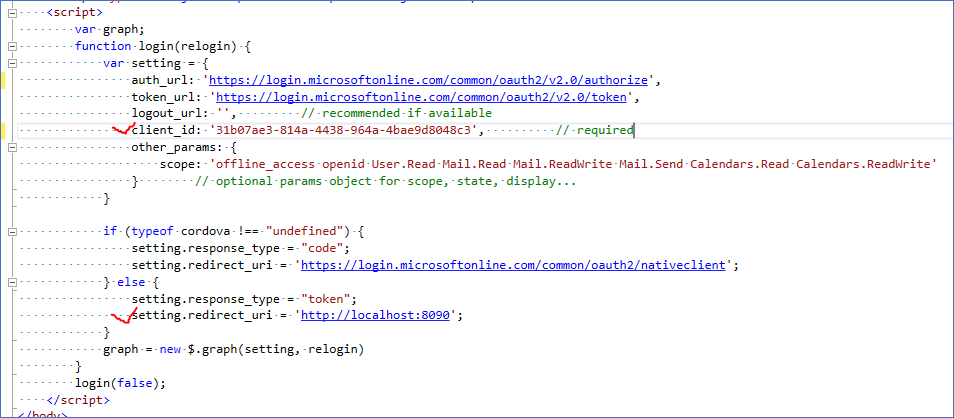

# Make this workshop as your own App
In this module you will register a App and configure this code to work with your app

# Register you app

1. [Register you app with the Azure AD](https://developer.microsoft.com/en-us/graph/docs/concepts/auth_register_app_v2) as the "web application" 

2. Make sure you use the right redirect url

3. Make sure your use the right set of permission

## Update the configuration in your code, Set up the web site

1. Update the "client_id" and "redirect_uri" inside "index.html" file

2. Set up web site root path if you are not using visual studio for debugging

