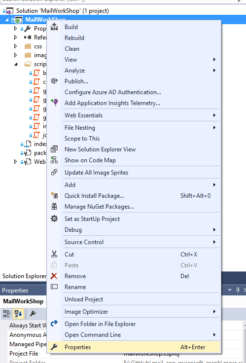
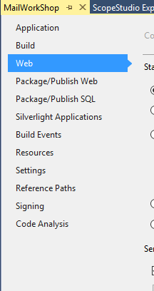

# FAQ
This is the FAQ document

## How to to change the web server port number in visual studio

1. Right click on the "MailWorkShop" project and select the properties 

2. Select the "Web" settings 

3. Update the port number 

