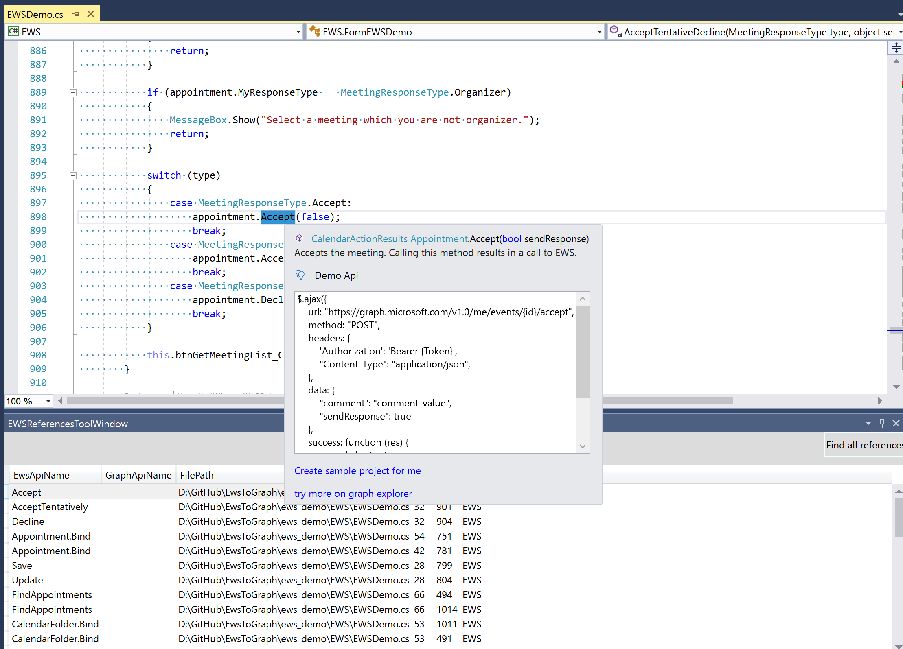

# Convert your EWS app to Graph app
Try out the EWSToGraph Visual Studio 2017 add-in which can help to convert your EWS app to Graph app

## Download and install the visual studio 2017 add-in
[EWSToGraph.vsix](https://github.com/InteropEvents/mail-app-microsoft-graph/blob/master/more%20resources/EWSToGraph/EWSToGraph.vsix)

## Find all your EWS references 
1. Show the EWS references window
 
2. Click the button and find all your EWS references

## Click one of the EWS reference and mouse over it, you will see the Graph information
 

