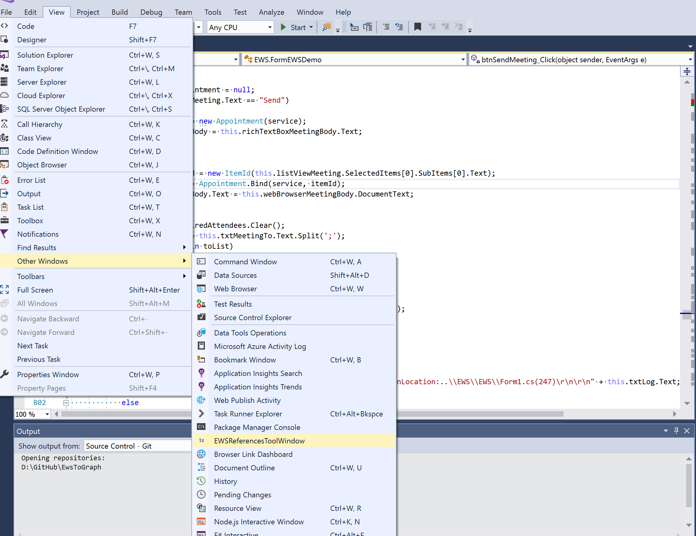
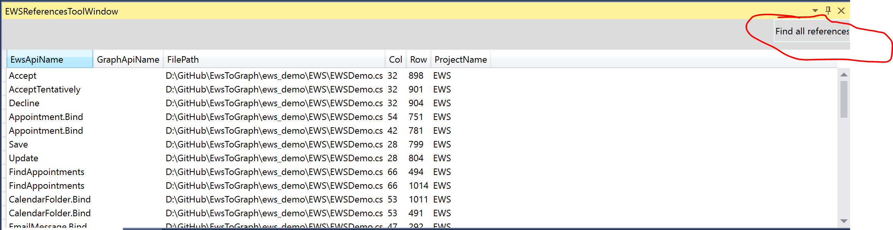

# Convert your EWS app to Graph app
Try out the EWSToGraph visual sutdio add-in which can help to convert your EWS app to Graph app

## Download and install the visual studio add-in
[EWSToGraph.vsix](https://github.com/InteropEvents/mail-app-microsoft-graph/blob/master/more%20resources/EWSToGraph/EWSToGraph.vsix)

## Find all your EWS references 
1. Show the EWS references window and find all your EWS calls
 

## Click one of the EWS reference and mouse over it, you will see the Graph information
 

